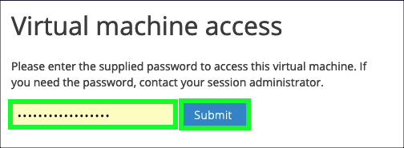
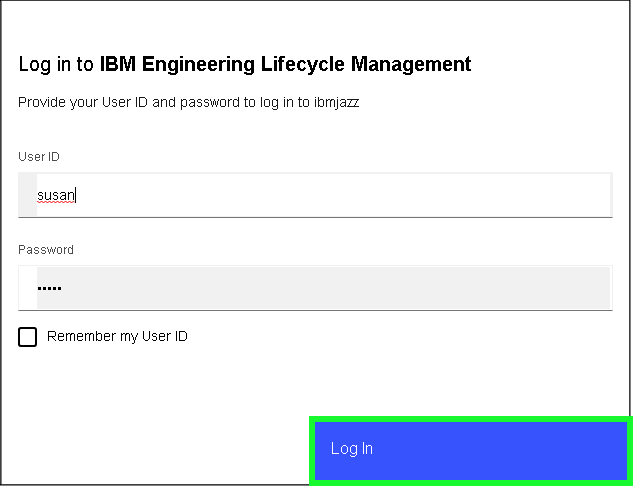
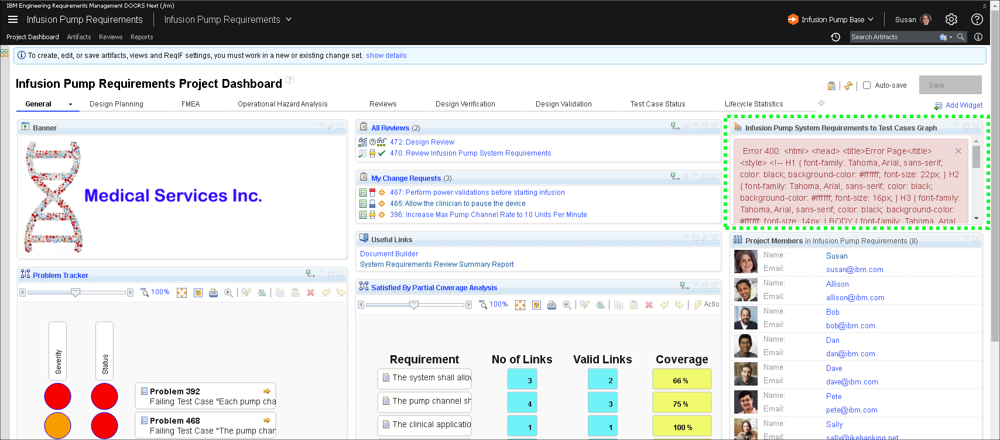
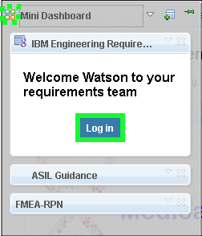
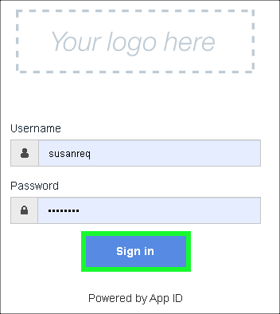
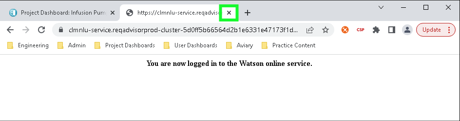
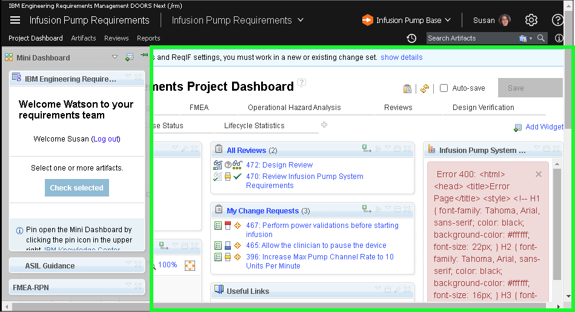
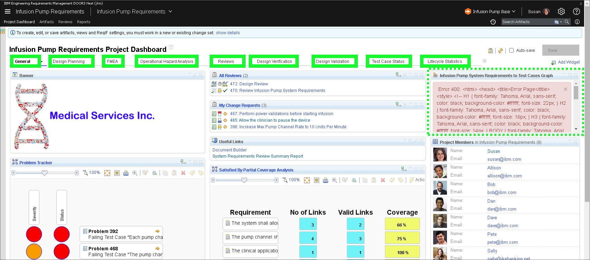

The following steps must be performed before delivering the demonstration. These steps should be performed several minutes prior to starting an actual client demonstration, as the software services used take a few minutes to start and enter a ready state.

## Prepare the browser-based web client

1. Open a browser window/tab using the URL found in the IBM Technology Zone email with the subject line "Your environment is ready".

If prompted for a **Virtual machine access** password like in the image below, enter the **Desktop password** specified in the IBM Technology Zone email with the subject line "Your environment is ready" (highlighted in the above image) and click **Submit**.

2. Click the **play** button to start the demonstration virtual machine (VM).

Wait until the VM changes from **Busy** to **Running** before proceeding.

3. Click on the **computer screen icon** to open the VM.

4. Click anywhere on the background to display the Administrator login prompt.
5. Log into Microsoft Windows using the ID: **Administrator** and Password: **{{tz_environment.adminPW}}**.

Note: the password contains two zero's and no capital Os.

The Jazz Servers are set to auto-start when Windows starts up, but they will take a few minutes before they are ready.

6. Click the **Chrome** browser icon  on the taskbar at bottom of screen.

7. Click the Chrome bookmark **Project Dashboards** and select the **Infusion Pump** bookmark.

!!! important
    All user names and passwords have been cached in the Chrome browser. This demonstration uses the **susan** user ID.

8. Click inside the User ID field and select **susan** from the list of users.

9. Click the **Log In** button.

The **Infusion Pump** demonstration dashboard is built of many different **widgets** as seen in the image below. When first loaded, some of the widgets may return an error (e.g. Error 400). This is expected and will be resolved later.

10. Click the **Mini Dashboard** icon  at top left of the **Infusion Pump** dashboard.

??? tip "Birds-eye view"
   

11. Click the **Log in** button in the **IBM Engineering Requirements XXXX** widget in the **Mini Dashboard**.

A new browser tab will open.

12. Click the **Sign in** button.

The **Username** and **Password** fields are pre-populated with the **susanreq** ID and password. Do not change these fields.

13. Close the web browser tab that was opened.

14. Click anywhere on dashboard to hide the **Mini Dashboard**.

<!-- At this point the **Infusion Pump** dashboard should be fully loaded with out errors. If not, wait a minute and click the browser refresh icon . Repeat if necessary. -->
To fix the broken widgets, slowly click through each of the **Infusion Pump Requirements Project Dashboard's** tabs. If after returning to the **General** tab the widget at far right is still reporting an error, try clicking the browser's refresh/reload button. Repeat this process a couple of times. The errors should resolve and data will appear in those widgets.

In **Act 1**, begin the journey to learn how to demonstrate IBM Engineering Lifecycle Management (ELM). Note, this is not a deep dive into IBM ELM, rather a brief overview of some of the major capabilities and benefits.
