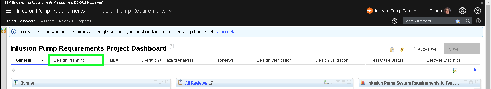
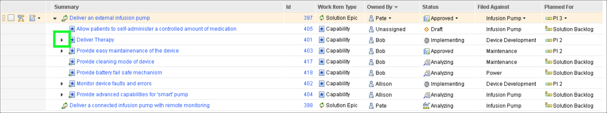

This demonstration flow is organized around the development process described in <a href="https://www.iso.org/standard/59752.html" target="_blank">ISO 13485</a> and <a href="https://www.iso.org/standard/72704.html" target="_blank">ISO 14971</a> for risk management.

!!! hint
    Prior to performing a client facing demonstration, it is beneficial to run through all the steps of the demonstration prior to doing so in front of the client. Doing so will cache all the web pages which will save a significant amount of load time. This will improve the performance of the environment and alleviate any awkward moments waiting for pages to load.

!!! quote "Sample narration"
    In this demonstration we’ll see how an infusion pump was engineered using the IBM ELM solution, in alignment with industry standards like ISO13485 and IEC 62304 for development and ISO 14971 for risk management. We’ll break the demo up into four acts:

    Starting with Design Planning. Here we’ll get an introduction to the platform and take a look at how the development work for our Infusion Pump is planned and tracked.

    Then we’ll take a look at Product Requirements where we’ll see some of the key capabilities around requirements management including traceability and audit trails.

    After that we’ll move on to Design Input where we’ll see how customer requirements are traced down to system requirements, how those requirements are checked for quality and reviewed for correctness and how we create baselines with electronic signatures. We’ll also see how we can perform risk management activities.

    After that we’ll move to Design Output where we’ll see Design Verification to prove coverage of the requirements by the design and Design Validation where we’ll show test coverage, test execution and defect tracking.

The following steps provide an overview of the ELM dashboard and the concept of "dash boarding".

1. Click the **Design Planning** tab on the **Infusion Pump Requirements Project Dashboard**.

2. Click the **IEC62304 Practice Content** link in the **Useful Links** widget.

Notice a new browser tab is opened.

3. Click the **IEC62304** option in left-hand sidebar.

4. Click the **+** next to **IEC 62304 Objectives** to expand the section.

5. Click **IEC 62304 SW Development Process**.

6. Click the **Objective 5.7.1** link in the detailed list in main window.

Note: scroll down if **Objective 5.7.1** is not visible in the list.

!!! quote "Sample narration"
    The detailed guidance in the delivery process is mapped to the Objectives in the standard, helping engineers to conform to the standard by meeting those objectives.

7. Click the **Develop Test Cases** link.

8. Explore the **Develop Test Cases** task.

Notice the **roles** associated with the task, the **detailed guidance steps**, and additional information links like **Tool Mentors** (scroll down as required).

9. Close the **Medical Devices** browser tab by clicking the **X** and return to the **Requirements Management (RM)** browser tab.

Now is a good time to explore the other widgets on the **Design Planning** tab of the **Infusion Pump Requirements Project Dashboard**.

10. Click the **Solution Roadmap** widget title.

11. Notice the **Epics** defined as work items on the roadmap.
12. Click the  next to the **Deliver an external infusion pump** work item.

13. Notice the items with the **Work Item Type** equal to **Capability**.

14. Click the  next to the **Deliver Therapy** **Capability**.

15. Notice the items with the **Work Item Type** equal to **Feature**.
16. Click the  next to the **Initiate drub infusion** **Feature**.

17. Notice the items with the **Work Item Type** equal to **Story**.
18. Notice the **Planned For** column.

19. Select **Roadmap with Tasks** in the **View As** pull-down menu.

??? tip "Birds-eye view"
   

20. Notice the detailed  under **Initiate drug infusion** with **Work Item Type** of **Task** and **Story**.

In Act 2, explore how **Project Requirements** are tracked in ELM.
