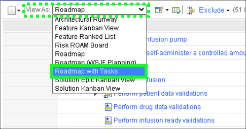

This demonstration flow is organized around the development process described in <a href="https://www.iso.org/standard/59752.html" target="_blank">ISO 13485</a> and <a href="https://www.iso.org/standard/72704.html" target="_blank">ISO 14971</a> for risk management.

The video below illustrates how this Act of the ELM demonstration can be performed for a client.

??? quote "Sample narration"
    Let’s start here on the infusion pump team dashboard. Dash-boarding is a common capability across the ELM platform. Dashboards can be created for the project, for teams, or personal dashboards can be created for individual users. Dashboards give instant access to the project data that's most relevant to you, whether you’re a Test Engineer looking at the current defect list or a Project Manager looking at the status of the project. And what’s more - the data presented in the Dashboards is always up to date.

    For example, here on the General tab of our team dashboard we have a widget showing a graph of how many system requirements have linked test cases and how many don't. We’ll see a few more later as we’ll be using this dashboard as a jumping off point to various parts of the demonstration.

    Let's start with this Design Planning tab. Here we see various widgets focussed on the planning aspects of our project – we’ll come back to those in a moment but first let's follow this link to the practice content.

    Practice content is a library of guidance for a specific workflow or standard that not only documents the process but provides guidance to engineers in their day to day work. Here for example we are looking at the practice library for the IEC 62304 standard which provides best practices for embedded software development for medical devices.

    Over here on the left, if we expand this category we can see the high level objectives of IEC 62304. If, on the other hand, we expand this category we can see that there is a delivery process which is a detailed, prescriptive workflow including activities and tasks on how to satisfy those objectives. Of course you can use your own process or customize this one.

    Let’s select the SW Development Process Objective. Here we can see a detailed list of the Objectives under that heading. 5.1 is all about planning, 5.2 is about requirements, 5.3 is focussed on architecture and so on.

    By way of example lets click on 5.7.1 – which is all about verification – and specifies that the SW Verification Tests shall cover all requirements and include inputs, outputs and selected outcomes.

    Below the Objective we can see how it is mapped to the workflow. There is a list of the related elements in the detailed workflow guidance that helps our engineering teams to actually meet these objectives.

    Let's dive into one of those – the task to develop test cases.

    Here we can see the various roles involved, the input and output work products from the task and detailed, step by step guidance on how to perform the task and achieve the objective. The guidance can even go so far as to describe how to perform the task in a specific tool – we call those tool mentors.

    Let's move back to our dashboard and take a look at how all of that guidance translates into actual work products.

    In order to comply with IEC62304 and ISO13485, we have to have a plan. Our Infusion Pump has a plan which, in this case, is organized using iterative agile principles. At the bottom we can see the development plans including one for each program increment and an overall solution roadmap.

    Those development plans contain concepts from standard agile practices including epics, features, stories and tasks – in a moment we’ll dive into one of those development plans and take a closer look but here on our dashboard we can get a clear view of the status of the project in many different ways.

    For example, on the left is a graph of all of the work items in the solution roadmap, grouped by their owner. On the right we can see some specific views that help with prioritizing the work according to agile principles. At the bottom we can see a traceability graph of where our features, capabilities and so on how been traced to requirements, design architecture and test cases.

    Let open the Solution Roadmap. Here we have two high level epics including this one - Deliver an external Infusion Pump. If we expand that epic we can see that it is broken down into Capabilities, and if we expand the Deliver Therapy capability, we can see that those are broken down into Features, and if we expand this Initiate Drug infusion Feature we can see that’s been broken down into User Stories. Over on the right we can see which program increment or sprint these artifacts are planned for.

    But there are also detailed tasks that have to be performed at each of these levels and those tasks map back to the practice content we saw earlier as well as the classical V-Lifecycle.

    If I switch the view to show those tasks in the tree then we can see at Capability level we have tasks for both sides of the top of the V Lifecycle - On the left hand side we perform functional analysis for the deliver therapy use case and on the right, perform system qualification testing for that same use case.

    At Feature level, we move down the V and the tasks are around the development of a system architecture, and system integration testing. And if we expand this story then we move further down and the tasks are at the software level – developing and testing software architectures.

    This is only one of many views we can use to consume and modify our planning data. For example here is a classic Kanban view and we can move work items through the process quickly and easily by dragging and dropping between these columns.

!!! hint
    Prior to performing a client facing demonstration, it is beneficial to run through all the steps of the demonstration prior to doing so in front of the client. Doing so will cache all the web pages which will save a significant amount of load time. This will improve the performance of the environment and alleviate any awkward moments waiting for pages to load.

The following steps provide an overview of the ELM dashboard and the concept of "dash boarding".

1. Click the **Design Planning** tab on the **Infusion Pump Requirements Project Dashboard**.

2. Click the **IEC62304 Practice Content** link in the **Useful Links** widget.

Notice a new browser tab is opened.

3. Click the **IEC62304** option in left-hand sidebar.

4. Click the **+** next to **IEC 62304 Objectives** to expand the section.

5. Click **IEC 62304 SW Development Process**.

6. Click the **Objective 5.7.1** link in the detailed list in main window.

Note: scroll down if **Objective 5.7.1** is not visible in the list.

7. Click the **Develop Test Cases** link.

8. Explore the **Develop Test Cases** task.

Notice the **roles** associated with the task, the **detailed guidance steps**, and additional information links like **Tool Mentors** (scroll down as required).

9. Close the **Medical Devices** browser tab by clicking the **X** and return to the **Requirements Management (RM)** browser tab.

Now is a good time to explore the other widgets on the **Design Planning** tab of the **Infusion Pump Requirements Project Dashboard**.

10. Click the **Solution Roadmap** widget title.

11. Notice the **Epics** defined as work items on the roadmap.
12. Click the  icon next to the **Deliver an external infusion pump** work item.

13. Notice the items with the **Work Item Type** equal to **Capability**.

14. Click the  icon next to the **Deliver Therapy** **Capability**.

15. Notice the items with the **Work Item Type** equal to **Feature**.
16. Click the  icon next to the **Initiate drug infusion** **Feature**.

17. Notice the items with the **Work Item Type** equal to **Story**.
18. Notice the **Planned For** column.

19. Select **Roadmap with Tasks** in the **View As** pull-down menu.

??? tip "Birds-eye view"
    

20. Notice the detailed under **Initiate drug infusion** with **Work Item Type** of **Task** and **Story**.

In Act 2, explore how **Project Requirements** are tracked in ELM.
