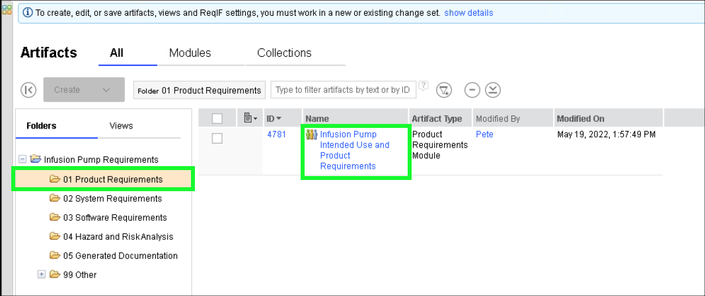

In Act 2, the topic of **Project Requirements** is explored as well as **Configuration** and **Change Management** of **Requirements**.

!!! quote "Sample narration"
    Now lets look at Product Requirements. Lets return to our dashboard and take a look at the requirement Artifacts for the infusion pump. Here we can see that we have Modules – or documents of requirements organized at various levels, but as you’ll see in a few minutes, the requirements in those documents are all connected.

    Lets open the Product Requirements document and take a closer look. These requirements reflect the end user needs, of course there are other documents reflecting regulatory requirements, system requirements, software requirements and so on.

    Here we have a rich editing environment including pictures, rich text, tables and so on. The document has hierarchy – for example if we collapse the document we can see it has major sections; an introduction, a general description of the product and then more detailed requirements. If we expand the specific requirements section, we can see those requirements are organized into functional, performance, operational and so on.

    Another important facet of good requirements management is granularity. Every sketch, requirement and heading in this document is an independent, atomic artifact which means that it can be directly referenced. As you will see later, traceability is between atomic artifacts rather than documents.

    It also means that multiple users can all edit this same document at the same time and It facilitates re-use at the granular level - an artifact can be added to multiple documents so no more copy and paste and the overhead that comes with it.

    Artifacts have type – for example this document has Headings, Information Items and Product Requirements. Product Requirements have a Priority and a Status whilst the other types do not. A strong typing system like this reduces typographical errors and improves the consistency and reportability of the data.

    Note that here we’ve applied a view to quickly switch from the document style we saw previously to more of a spreadsheet style. Any of the artifact attributes may be shown as columns and views can also filter the data – for example this view shows only Product Requirements, along with their priority and status. This allows the user to quickly and easily focus on what’s important at the time.

    Notice at the top of the page here is a notification that if we want to make any changes to this document then we have to do that as part of a change set. This project has been placed under change control. This allows the team to manage the impact of changes as well as ensuring that changes are only made with the appropriate approvals and that those changes are properly documented.

    Any changes that are made are automatically tracked and maintained for an audit trail. We can view the history of a single requirement – or in this case the entire document. This Audit History shows us every change that was made. Who made it, when it happened, the exact nature of the change and the change set in which it was made.

    Now lets look at traceability which is mandated in ISO 13485

    Traceability:
    Traditionally, traceability is maintained in separate documents such as spreadsheets – a manual process, prone to error, very costly to maintain and outdated as soon as the author clicks “save”. In the ELM platform traceability is added directly to the artifacts themselves – right here in the web browser.

    This view shows us not only the product requirements for the Infusion Pump but also the system requirements further downstream that satisfy them. For example – this product requirement – 4968 is satisfied by this system requirement 4812.

    If we hover our mouse over a linked requirement – like 4812, we can see another common capability across the platform – Rich Hover.  Whenever we have a link to another engineering artefact we can see key information about it without actually following the link. That might be a linked requirement as in this case but it might also be a requirements engineer looking at a linked design – or a test engineer looking at a requirement they are testing against. It’s a huge time saver.

    We can also easily see Gap Analysis – which of these requirements has no traceability downstream – for example here requirement 5023 has no system level coverage. Of course that kind of information is also easily exposed onto dashboards – as we’ll see later.

    Here we can see Link Validity. Whenever two artifacts are linked – if one of those artifacts changes then the connection between them becomes suspect. Here for example the link between 4968 and 4812 is suspect because one of those requirements got changed. Now an analysis is required to confirm that the link is still valid.

    The ELM Platform automatically highlights when this happens so making that assessment is much easier and of course this is another common feature so that also applies for the linked models, test cases and so on.

1. Click the Chrome bookmark **Project Dashboards** and select the **Infusion Pump** bookmark.

!!! warning
    Do not try to click Project Dashboard in the menu bar as that will open the CCM project dashboard and not the RM dashboard.

2. Click the **Artifacts** tab in the main header bar.

??? info "Birds Eye View"
    

3. Click on each folder in turn to show the hierarchy of requirements documents (Modules).

Take note of the various **Artifact Types** of the documents, such as the **04 Hazard and RiskAnalysis** artifact types shown below.

4. Click the **Product Requirements** folder, and then click **Infusion Pump Product Requirements**.

5. Notice the graphics, rich text, tables, and hierarchy of the artifact.

6. Refine the view. In the view's header bar, click the menu button and click **Show Full Hierarchy** and then **Show 1 Level**.

7. Click the  icon next to the **3 Specific Requirements** content item.

Note the various categories of requirements defined.

8. Click the  icon next to the **3.1 Functional Requirements** content item.

9. Click checkbox next to the first functional requirement: **This device shall use a valve...**.

Notice that each **object** in the document is an independent, atomic artifact.  This enables multiple engineers to author and edit the document at the same time. When a requirement is being edited, it is automatically locked preventing others from editing it, but other objects can be edited by others. It also facilitates reuse as any of these artifacts can be used in multiple documents without having to copy and paste content.

10. Click the **1. Artifact Attributes** link in the **Views** panel.

??? info "Birds eye view"
    

11. Notice that each artifact can be of a different type, and have different attributes based upon the type.

A strong **typing** system reduces typographical erros and improves the consistency and reportability of the data.

12. Click the **2. Product Requirements** link in the **Views** panel.

Notice the **views** can also filter the displayed document data.  In this case filtering out **Headings** and showing only **Product Requirements**.

Next, explore the configuration and change management capabilities in ELM.
