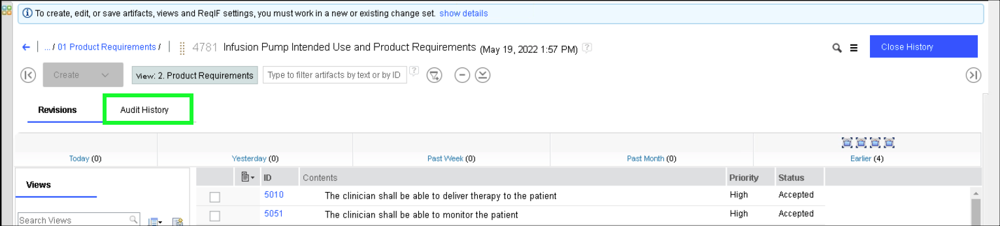
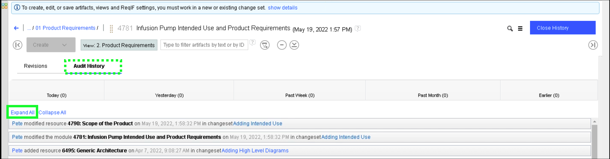
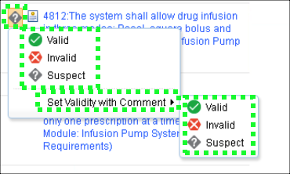

!!! quote "Sample narration"
    Now lets look at traceability which is mandated in ISO 13485

    Traceability:
    Traditionally, traceability is maintained in separate documents such as spreadsheets – a manual process, prone to error, very costly to maintain and outdated as soon as the author clicks “save”. In the ELM platform traceability is added directly to the artifacts themselves – right here in the web browser.

    This view shows us not only the product requirements for the Infusion Pump but also the system requirements further downstream that satisfy them. For example – this product requirement – 4968 is satisfied by this system requirement 4812.

    If we hover our mouse over a linked requirement – like 4812, we can see another common capability across the platform – Rich Hover. Whenever there is a link to another engineering artifact, the key information about it is seen without actually following the link. That might be a linked requirement as in this case, but it might also be a requirements engineer looking at a linked design – or a test engineer looking at a requirement they are testing against. It’s a huge time saver.

    We can also easily see Gap Analysis – which of these requirements has no traceability downstream – for example here requirement 5023 has no system level coverage. Of course that kind of information is also easily exposed onto dashboards – as we’ll see later.

    Here we can see Link Validity. Whenever two artifacts are linked – if one of those artifacts changes then the connection between them becomes suspect. Here for example the link between 4968 and 4812 is suspect because one of those requirements got changed. Now an analysis is required to confirm that the link is still valid.

    The ELM Platform automatically highlights when this happens so making that assessment is much easier and of course this is another common feature so that also applies for the linked models, test cases and so on.

Notice the banner at the top of the **Artifacts** tab.

The message informs users that the module is under change management. Later in the demonstration script a new change set will be created. For now, learn about the audit and traceability capabilities of ELM.

1. Click the **Open History** menu item under the hamburger menu  icon.

??? info "Birds eye view"
    

2. Click the **Audit History** tab.

3. Click the **Expand All** link.

4. Notice the full audit trail.

From this view, auditors can view who changed what, when the change was made, and in which **change set**.

5. Click the **Close History** button.

6. Click the **3. Satisfied By** link in the **Views** panel.

7. Notice the columns can show **traceability**.

Here, **traceability** is seen in the **Satisfied By** column. Rows with data in the **Satisfied By** column provide links to the downstream system requirements that satisfy these higher-level requirements. Notice that several rows have no information in the **Satisfied By** column. These empty fields illustrate **gaps** in the requirements providing a **gap analysis** traceability view.

8. Hover the mouse over the **4968** link in the **ID** column (don't click the link).

Notice the additional details about the requirement that are visible by simply hovering over the item in the table.

9. Click the first  icon in the **Satisfied By** columns.

Notice the options available to set the **link validity** for the requirement.

Traditionally, traceability is maintained in separate documents such as spreadsheets – a manual process, prone to error, very costly to maintain, and usually outdated as soon as the author clicks “save”. Here traceability is added, maintained, and tracked directly in the IBM solution and can easily be reported on.

To learn more about **link validity** go <a href="https://www.ibm.com/docs/en/elm/7.0.3?topic=configurations-link-validity-in-elm" target="_blank">here</a>.

For Act 3, remain on the current browser page and learn about ELM's design input capabilities.
