In Act 3, the topic of **Project Requirements** and **Change Management** of requirements is explored.

!!! quote "Sample narration"
    Next, let us look at Design Input. We are starting where we left off – here in the Product Requirements document, looking at the traceability downstream to System Requirements.

    Now, let us follow one of those links.

    We are now looking at the System Requirements document. If we apply this view we can see the traceability back to the product requirements upstream as well as to the software requirements downstream.

    For example – system requirement 4812 satisfies product requirement 4968 and itself is satisfied by three software requirements.

    Next we’ll put these requirements through a review cycle but before we do that we’re going to use the power of AI to check and improve their quality. It’s likely that we’ll need to edit the requirements so let us start by creating a Change Set to encapsulate those changes. Note that our engineer Susan is now working in her own private area – any changes made here are isolated from the rest of the team until they are delivered.

    In a real project we would trace this change set to a work item and the platform can even be configured so that we cannot deliver any changes back to the team without a work item with the appropriate approvals on it – you will see those approvals in a moment when we look at reviews.

    For now let us just check our requirements.
    This view filters the document to show only System Requirements and also adds columns for some attributes that will store the result of our quality check – which is useful for reporting later.

    Let's select all of our requirements and ask the Requirements Quality Assistant or RQA to check them. RQA analyses the requirements using Watson Natural Language Processing and then scores them against the rules defined in the INCOSE Requirements Engineering handbook – or indeed against custom rulesets for specific projects or domains.

    Here we can see that most of the requirements have scored well – and a couple need some work. Take a look at one of those. First RQA gives us the reason for the score – in this case we have an Unclear Term – the phrase In A Clear manner is ambiguous and subjective which makes it very difficult to test.

    Detailed guidance on how to improve poorly written requirements is included – an essential tool to help less experienced requirement writers improve their skills.

    Note that this isn’t something as simple as a keyword search – the requirement below this one also has the word clear in it – but in that context it’s not ambiguous and the requirement scores 100.

    RQA goes beyond simple keyword searches, it can understand context, meaning and intent.

    We can fix that requirement fairly easily – in this case that ambiguous phrase is actually not needed at all so let's remove it – and then ask RQA to recheck that requirement. Identifying and fixing quality issues like ambiguous, incomplete and poorly structured requirements before a review saves time and reduces cost – domain experts can spend their valuable time reviewing the intent of a requirement rather than wasting time fixing things like inconsistencies.

    In a real project we would fix all of the issues, deliver the requirements back to the team and create a Baseline of the requirements ready for the review. As this is a demo, I’ve already created that baseline and the review so I’m just going to discard this change set and then I’ll switch from Susans personal editing area back to the team area.

1. Click the **4812** requirement link in the **Satisfied By** column.

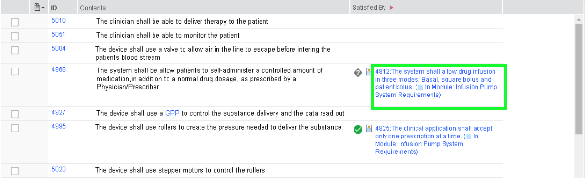

2. Click the **3. Up and Downstream Satisfaction** in the **Views** panel.

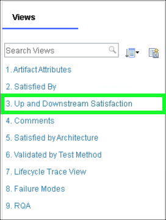

Now use Requirements Quality Assistant (RQA) to check the quality of the requirements. RQA can populate the scores returned and the reasons for any low scores as attributes in the module. For these attributes to be populated, the module must be writable and so you will start by creating a **change set**.

A **change set** allows a team to manage the impact of changes and ensures that changes are only made with the appropriate approvals, and that those changes are properly documented. Typically, this option is enabled when the project reaches a milestone and/or stable state.

3. Click the **current context button** at top right of header bar.

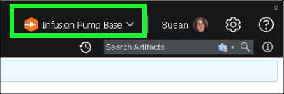

??? info "Birds eye view"
    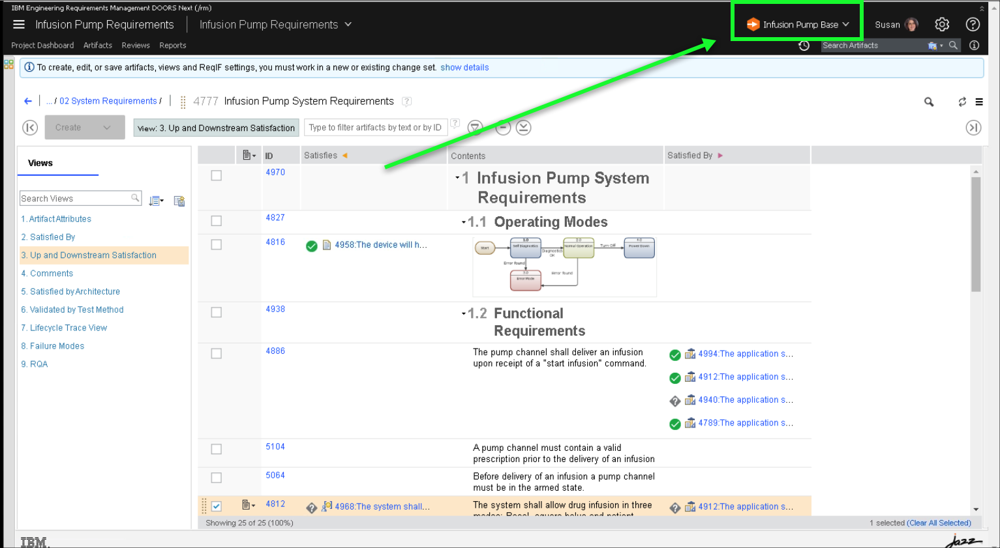

4. Click **Create Change Set...**.

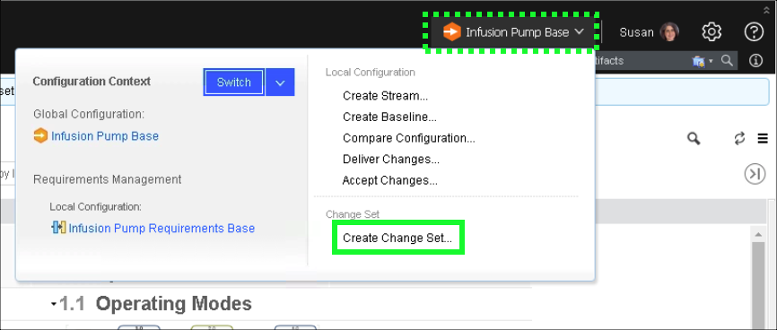

5. Enter **Checking Requirements Quality** in the **Name** text entry field.

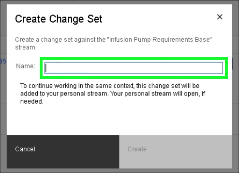

6. Click the **Create** button.

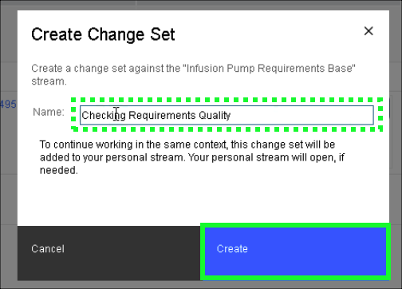

7. Click the **current context button** and verify the current change set is **Checking Requirements Quality**.

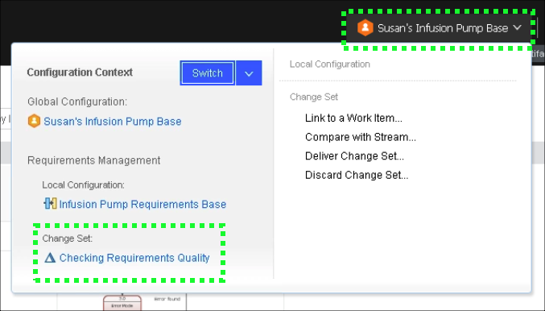

8. Click the **Mini Dashboard**  icon.

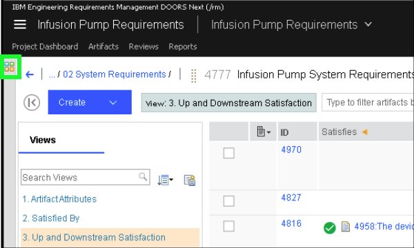

9. Click the **Pin**  icon to keep the **Mini Dashboard** open.

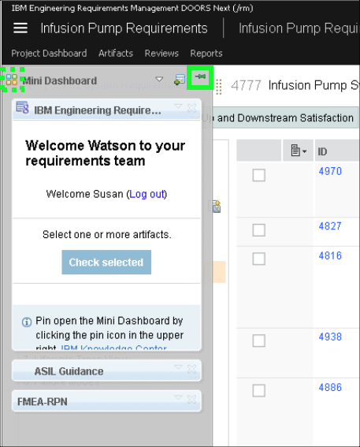

10. Click the **9. RQA** link in the **Views** panel.

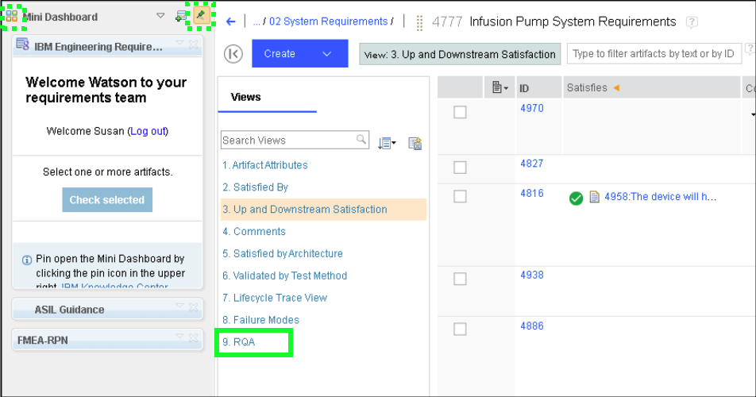

Take notice of the columns in the RQA view: **RQA Score** and **Issues Found by RQA**.

11. Click the **double arrow**  icon in the sidebar to collapse both the left and right-hand sidebars.

Hover the mouse between the **Views** panel and the table of **Requirements**.

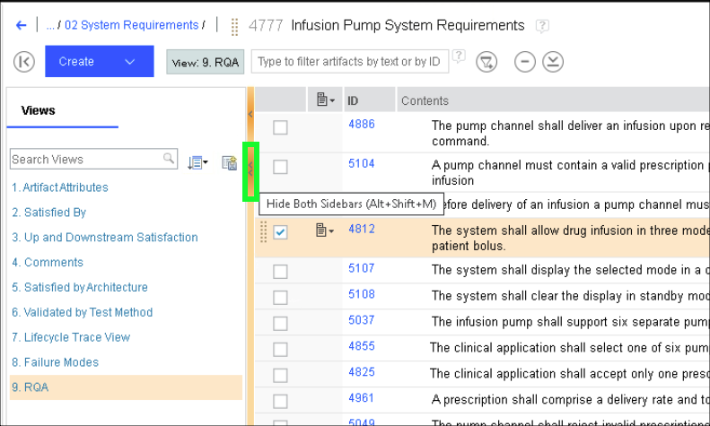

12. Click the **checkbox** next to the **first requirement**.

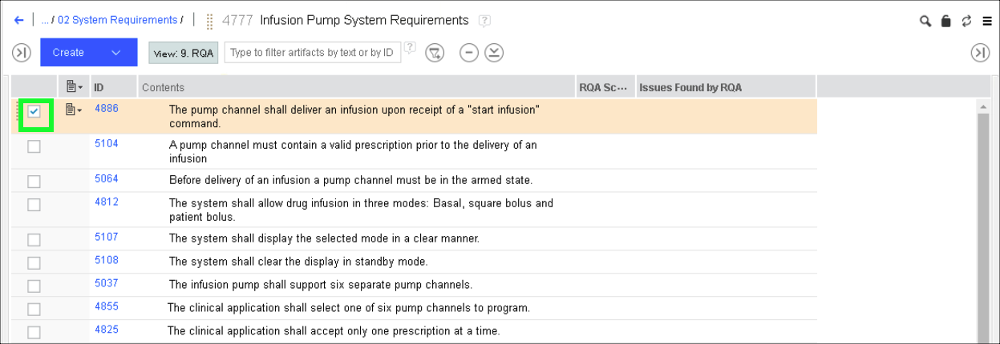

13. Scroll down to bottom of list, hold down the **Shift** key, and click the **checkbox** for the **last requirement** to select all the requirements.

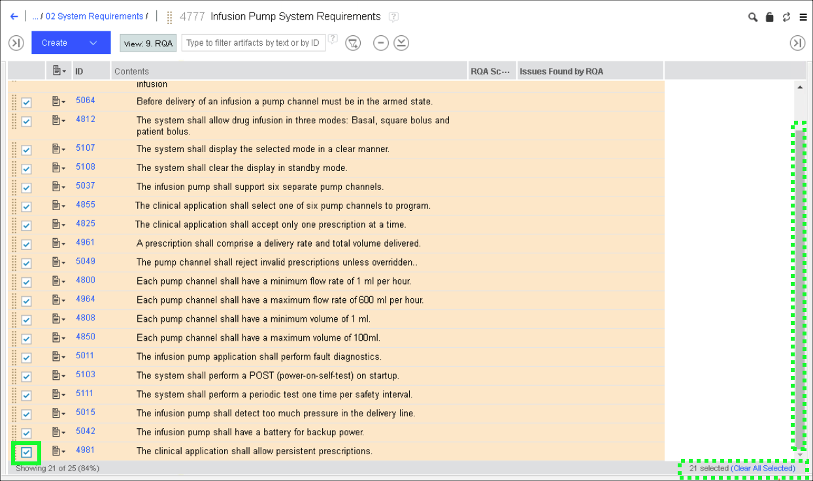

14. Click the **Check selected** button in the RQA panel of the **Mini Dashboard**.

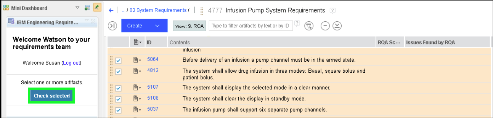

It will take a few seconds for the RQA scoring to complete.

15. Drag the right-hand side of the **Mini Dashboard** to the right to expand it.

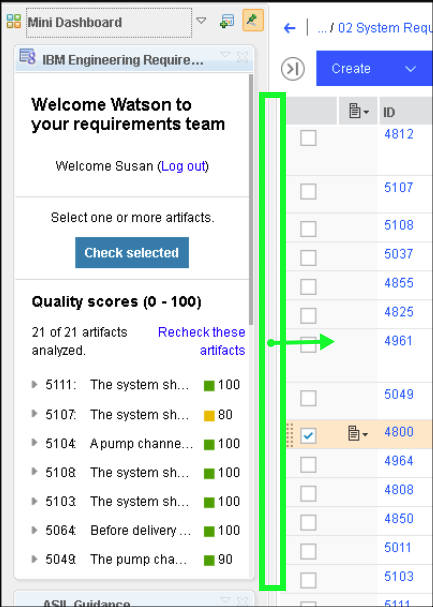

16. Notice the scores returned have been recorded as attributes and the reason for any low scores.

17. Click the **5107** requirement in the **RQA panel** of the **Mini Dashboard**.

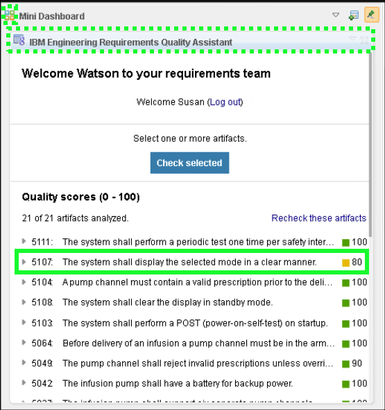

!!! warning
    The RQA team releases a new version every 2 weeks. It is impossible to keep training material up to date with that schedule. The scores returned by RQA may therefore be completely different than the ones recorded in this document. If this is the case then skip fixing the requirement below and discard the change set.

18. Click **Show details** under the **5107 requirement**.

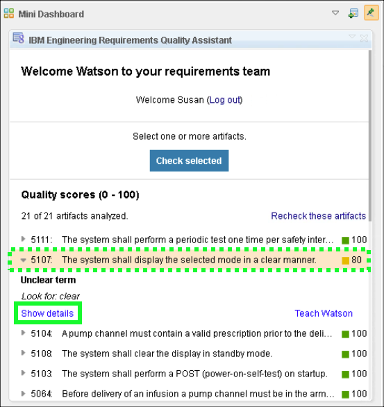

19. In the main table, **Double-click** inside the text of the **5107 requirement** to edit it.

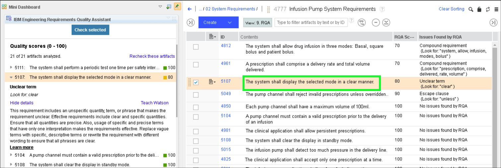

20. Delete the text **in a clear manner** and click away from the requirement to apply the change.

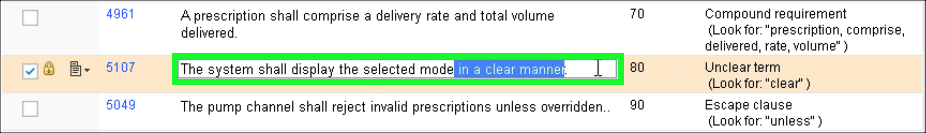

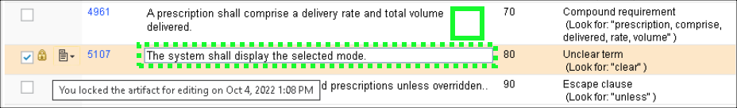

Now that the ambiguity of the requirement is removed, recheck the modified artifact.

21. Click the **recheck**  icon in the **RQA panel** of the **Mini Dashboard** for the updated requirement.

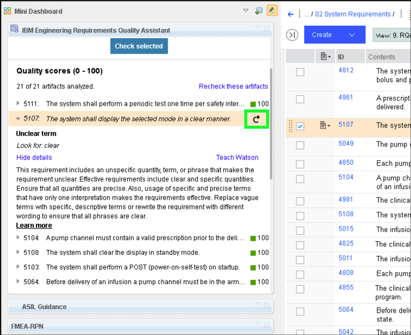

22. Notice the **5107 requirement** now scores a 100.

Checking the requirements for quality is not a replacement for a review rather an enhancement. Check and fixing quality before going into a review means that domain experts can spend their valuable time reviewing the intent of the requirement rather than wasting time on poorly written requirements.

In a real project all requirements would be checked and fixed before creating a baseline and moving into a review cycle. For this demonstration environment, the changes will be discarded.

21. Click the **Pin**  to collapse the **Mini Dashboard**>

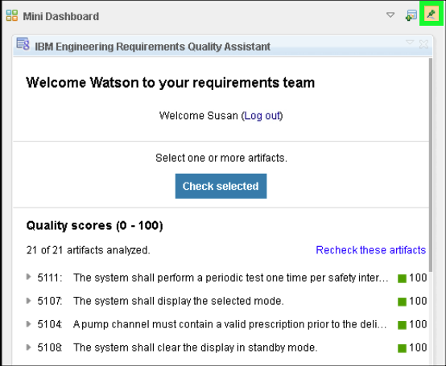

22. Click away from the **Mini Dashboard** so it slides back in place.
23. Click the **current context button**.

24. Click **Discard Change Set...**.

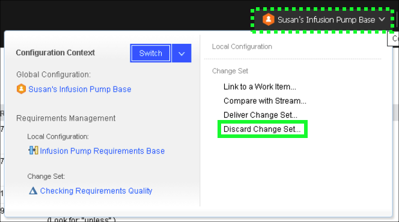

25. Click the **Discard the Change Set** button.

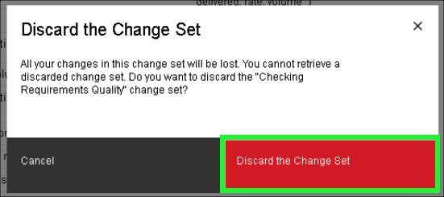

!!! important "Important"
    Creating a change set moves the context out of the base global configuration into Susan’s personal stream. Discarding (or delivering) the change set does return to the base global configuration – one must switch back to the base ‘variant’ of the product using the favorites menu.

26. Click the **current context button**.

27. Click the **dropdown** button to see the recently used and favorite configurations.

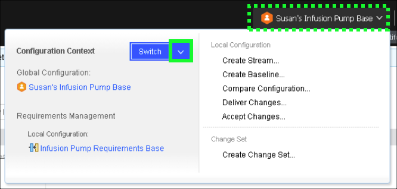

28. Click the **Infusion Pump Base** global stream.

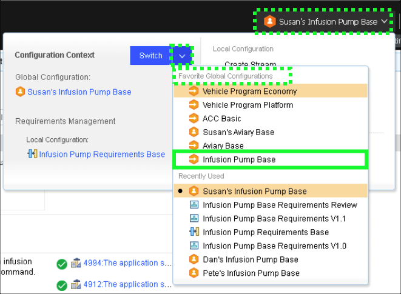

29. Click the **collapsed left-hand sidebar** to expand and reveal the **Views** panel.

Next, examine the **Review** process in ELM.
