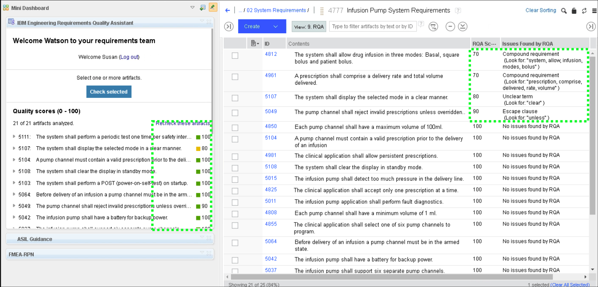
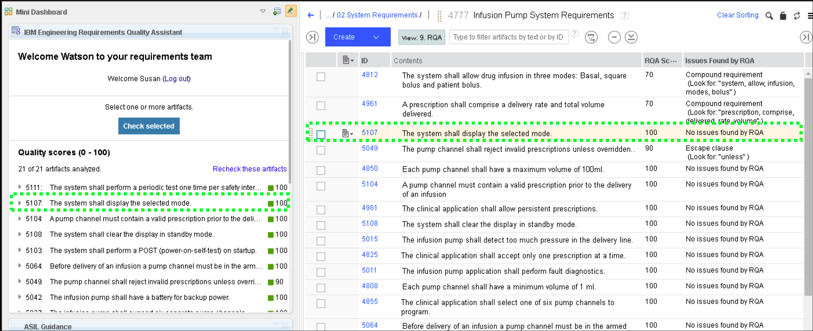
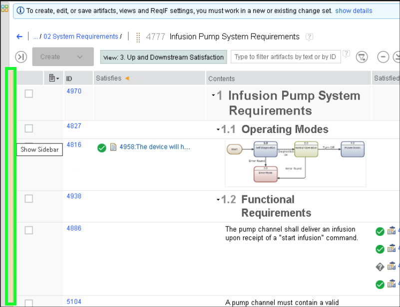

The video below illustrates how this Act of the ELM demonstration can be performed for a client.

??? quote "Sample narration"
    Next, let us look at Design Input. We are starting where we left off – here in the Product Requirements document, looking at the traceability downstream to System Requirements.

    Now, let us follow one of those links.

    We are now looking at the System Requirements document. If we apply this view we can see the traceability back to the product requirements upstream as well as to the software requirements downstream.

    For example – system requirement 4812 satisfies product requirement 4968 and itself is satisfied by three software requirements.

    Next we’ll put these requirements through a review cycle but before we do that we’re going to use the power of AI to check and improve their quality. It’s likely that we’ll need to edit the requirements so let us start by creating a Change Set to encapsulate those changes. Note that our engineer Susan is now working in her own private area – any changes made here are isolated from the rest of the team until they are delivered.

    In a real project we would trace this change set to a work item and the platform can even be configured so that we cannot deliver any changes back to the team without a work item with the appropriate approvals on it – you will see those approvals in a moment when we look at reviews.

    For now let us just check our requirements.
    This view filters the document to show only System Requirements and also adds columns for some attributes that will store the result of our quality check – which is useful for reporting later.

    Let's select all of our requirements and ask the Requirements Quality Assistant or RQA to check them. RQA analyses the requirements using Watson Natural Language Processing and then scores them against the rules defined in the INCOSE Requirements Engineering handbook – or indeed against custom rulesets for specific projects or domains.

    Here we can see that most of the requirements have scored well – and a couple need some work. Take a look at one of those. First RQA gives us the reason for the score – in this case we have an Unclear Term – the phrase In A Clear manner is ambiguous and subjective which makes it very difficult to test.

    Detailed guidance on how to improve poorly written requirements is included – an essential tool to help less experienced requirement writers improve their skills.

    Note that this isn’t something as simple as a keyword search – the requirement below this one also has the word clear in it – but in that context it’s not ambiguous and the requirement scores 100.

    RQA goes beyond simple keyword searches, it can understand context, meaning and intent.

    We can fix that requirement fairly easily – in this case that ambiguous phrase is actually not needed at all so let's remove it – and then ask RQA to recheck that requirement. Identifying and fixing quality issues like ambiguous, incomplete and poorly structured requirements before a review saves time and reduces cost – domain experts can spend their valuable time reviewing the intent of a requirement rather than wasting time fixing things like inconsistencies.

    In a real project we would fix all of the issues, deliver the requirements back to the team and create a Baseline of the requirements ready for the review. As this is a demo, I’ve already created that baseline and the review so I’m just going to discard this change set and then I’ll switch from Susans personal editing area back to the team area.

    As per ISO 13485, requirements need to be approved and reviewed. Lets return to our dashboard and see how a review cycle takes place. Here we have a work item to review the System Requirements for the Infusion Pump. Here on the approvals tab there are several approvals that are required to complete this work – the reviews themselves and a final managerial approval. Here on the links tab there are several links: The review baseline is the document that our reviewers have been asked to review.  This child task is an issue that was raised during the review and lastly the approved baseline is a link to the baselined document after the review was completed and the requirements were approved.

    Let's start by clicking the Review baseline link. Note that the system requirements document has opened – but in the context of a Baseline, and so these artifacts are all frozen and cannot be edited.

    Let's go back to the work item and click the child task. Here we can see that this is an Issue – raised by one of our reviewers, Dan, and he’s assigned the work item to Susan to resolve. At the bottom we can see a description of Dan’s issue – he doesn’t think the requirement is complete enough and has also identified a potential missing requirement. Further down we can see that Susan has replied – she agreed and made some changes to the document in response to the review comment.

    On the Approvals tab, Dan added himself as the approver. Note that the parent review work item would not have been allowed to close until all of its children were also approved and closed – so any issues raised during the review would prevent it from completing until they were addressed.

    On the links tab there is a link to the requirement that had a problem – which helped Susan identify it in the document. Let's follow that link and take a look.

    Again we are in the context of the review baseline and the requirement reads The system shall perform a self test on initiation. As we saw in the work item, Susan agreed with the review comment that is was not complete enough and made some changes – after that the review work item was approved and closed, and another baseline was taken and electronically signed. Let’s switch to that baseline and see what happened. It may not be immediately obvious what the changes were but the ELM Platform allows us to compare artifacts to see any differences – in this case let’s compare this approved baseline to the original review baseline.

    Here we can see the additional requirement that Susan added as well as the existing requirement that was modified – highlighted in blue. We can dive deeper into that requirement and see the modifications that were made.

    Let's now close that comparison and return to the document. Next we can follow this link to the actual approved baseline where we can see its electronic signature.

    Now let’s look at risk management. First we’ll return to our project dashboard and once again we’ll switch back to the main team working area.

    Here on our dashboard we have two tabs of interest – FMEA or Failure Modes and Effects Analysis and Operational Hazard Analysis. There are many similarities between the two – they both examine failure modes, effects and causes – the primary difference is that operational hazard analysis focuses on what could go wrong if the product is used incorrectly whilst FMEA focuses on the identification of possible failures in the design of the product components.

    Let's start with FMEA. Our dashboard is surfacing the results of the FMEA analysis in a consumable way – for example at the top here we have a traceability view from the system requirement to a potential failure related to that requirement, to the safety requirement that was created to mitigate against the risk of that happening.

    On the right we have more of a metrics view – how many failure modes are mitigated by safety requirements and how many are not.

    These are not just pictures of course this is all live data. Let’s use the traceability view to navigate into the FMEA document and see the analysis.

    Here we can see the columns of information that allow us to perform the FMEA – the identified failure mode, the effects of that failure, its potential causes and any current controls we have in place. Those assessments allow us to assign numeric values for Severity, Probability and Detection – and those can then be used to calculate the Risk Priority Number or RPN which is a simple measure of comparison.

    The platform can help by automating steps and performing calculations on the data.

    Let's see an example of this in action – we’ll start by making a change set so we can make some changes to this data.

    Then let's edit this Risk Priority Number and actually delete that value.

    Now in our mini-dashboard we can expand this RPN Calculator which will perform that calculation for us and populate the field again. Of course that’s a very simple example and a very simple calculation but it shows how the basic capabilities of the platform may be extended with automation widgets like these.

    OK lets go ahead and discard that change set – and as before we’ll also switch back to the team area.

    Back on our Project Dashboard lets now select Operational Hazard Analysis. That analysis is performed in much the same way as FMEA with the major difference being that these hazards are the result of user error rather than device failure.

    The ELM Platform allows for automatic generation of federated documentation. Here we have a link to an automatically generated document that combines both of those analyses into a Risk Management File.

1. Click the **4812** requirement link in the **Satisfied By** column.

2. Click the **3. Up and Downstream Satisfaction** in the **Views** panel.

Now use Requirements Quality Assistant (RQA) to check the quality of the requirements. RQA can populate the scores returned and the reasons for any low scores as attributes in the module. For these attributes to be populated, the module must be writable and so you will start by creating a **change set**.

A **change set** allows a team to manage the impact of changes and ensures that changes are only made with the appropriate approvals, and that those changes are properly documented. Typically, this option is enabled when the project reaches a milestone and/or stable state.

3. Click the **current context button** at top right of header bar.

??? info "Birds-eye view"
    

4. Click **Create Change Set...**.

5. Enter **Checking Requirements Quality** in the **Name** text entry field.

6. Click the **Create** button.

7. Click the **current context button** and verify the current change set is **Checking Requirements Quality**.

8. Click the **Mini Dashboard**  icon.

9. Click the **Pin**  icon to keep the **Mini Dashboard** open.

10. Click the **9. RQA** link in the **Views** panel.

Take notice of the columns in the RQA view: **RQA Score** and **Issues Found by RQA**.

11. Click the **double arrow**  icon in the sidebar to collapse both the left and right-hand sidebars.

Hover the mouse between the **Views** panel and the table of **Requirements**.

12. Click the **checkbox** next to the **first requirement**.

13. Scroll down to bottom of list, hold down the **Shift** key, and click the **checkbox** for the **last requirement** to select all the requirements.

14. Click the **Check selected** button in the RQA panel of the **Mini Dashboard**.

It will take a few seconds for the RQA scoring to complete.

15. Drag the right-hand side of the **Mini Dashboard** to the right to expand it.

16. Notice the scores returned have been recorded as attributes and the reason for any low scores.

17. Click the **5107** requirement in the **RQA panel** of the **Mini Dashboard**.

!!! warning
    The RQA team releases a new version every 2 weeks. It is impossible to keep training material up to date with that schedule. The scores returned by RQA may therefore be completely different than the ones recorded in this document. If this is the case, then skip fixing the requirement below and discard the change set.

18. Click **Show details** under the **5107 requirement**.

19. In the main table, **Double-click** inside the text of the **5107 requirement** to edit it.

20. Delete the text **in a clear manner** and click away from the requirement to apply the change.

Now that the ambiguity of the requirement is removed, recheck the modified artifact.

21. Click the **recheck**  icon in the **RQA panel** of the **Mini Dashboard** for the updated requirement.

22. Notice the **5107 requirement** now scores a 100.

Checking the requirements for quality is not a replacement for a review rather an enhancement. Check and fixing quality before going into a review means that domain experts can spend their valuable time reviewing the intent of the requirement rather than wasting time on poorly written requirements.

In a real project all requirements would be checked and fixed before creating a baseline and moving into a review cycle. For this demonstration environment, the changes will be discarded.

21. Click the **Pin**  to collapse the **Mini Dashboard**>

22. Click away from the **Mini Dashboard** so it slides back in place.
23. Click the **current context button**.

24. Click **Discard Change Set...**.

25. Click the **Discard the Change Set** button.

!!! important "Important"
    Creating a change set moves the context out of the base global configuration into a personal stream (Susan's in this environment). Discarding (or delivering) the change set does not return to the base global configuration – one must switch back to the base ‘variant’ of the product using the favorites menu.

26. Click the **current context button**.

27. Click the **dropdown** button to see the recently used and favorite configurations.

28. Click the **Infusion Pump Base** global stream.

29. Click the **collapsed left-hand sidebar** to expand and reveal the **Views** panel.

Next, examine the **Review** process in ELM.
