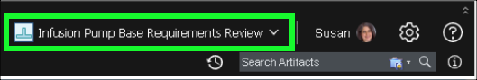

1. Click the **Project Dashboard** tab in the top header bar.

2. Notice there are several **reviews** on the dashboard.

??? info "Birds-eye view"
    

3. Click **470: Review Infusion Pump System Requirements**.

Note that the **470: Review Infusion Pump System Requirements** is already complete (green checkbox). In a real project a quality review would be performed before baselining requirements and before entering a review cycle.

4. Notice that **Review 470** is a **Work Item**.

5. Click the **Approvals** tab.

6. Notice the different types of **approvals** and **approvers**.

7. Click the **Links** tab.

8. Notice the different **Links** shown.

Note that there are links to the baseline of the requirements the review was created against, another link to the final approved baseline (created after the review), and a link to a child work item (this was a problem identified during the review).

9. Click the **Review baseline** link.

10. Notice that the link opens a view to the module in the context of the **Review Baseline**.

11. Click the web browser **Back** button.

12. Click the **483: Issue with Self Test Requirement** link.

13. Notice the information captured for **Problem 483**.

14. Scroll down and notice the comment added by Susan.

15. Scroll up and click the **Approvals** tab.

16.  Notice that Dan has added himself as the approver for the **work item**.

A parent review work item cannot be closed until all children have been approved and closed.

17. Click the **Links** tab.

18. Click the **5103: The system shall perform a self test on initiation** under **Related Artifacts**.

19. Notice the link returns to the **Requirements Review Baseline** with **5103: The system shall perform a self test on initiation** selected.

20. Click the **current configuration button**.

21. Click the **Switch** button.

22. Click the **Requirements Management Configuration** tab in the **Configuration Context** dialog.

23. Select **Baselines** in the **Component** pull-down menu.

24. Enter an **\*** in the search box to show all **Baselines**.

25. Click **Infusion Pump Base Requirements Approved** in the list of **All configurations**.

26. Click the **OK** button.

27. Click the **current context button**.

28. Click **Compare Configuration...** under **Local Configuration**.

29. Click **Baselines** in the **Component** pull-down menu.

30. Select **Infusion Pump Base Requirements Review** in the table.

31. Click **OK**.

32. Click **Next** two (2) times in the **Compare wizard**.

33. Click **In both, but different (2)** button at the bottom of the side bar.

??? info "Birds-eye view"
    

34. Click **4777: Infusion Pump System Requirements**.

35. Click the **5103** requirement to select it in left-hand table.

!!! bug
    Orange boxes may appear in the output as shown in the image above. They can be ignored.

36. Click the **Show changes** link.

If the **Show changes** link doesn't appear, hover the mouse over the text for the requirement.

37. Explore the information provided on the comparison screen.

38. Click the **X** at top right to close the **Artifact compare** dialog.

39. Click the **Close** button to close the **Comparison wizard**.

The platform can be configured such that changes cannot be delivered unless those changes are linked to a work item with the appropriate approvals. In this project, after the review cycle was completed and approved, a new baseline was taken and signed with an electronic signature as shown in the next steps.

40. Click the **current configuration** button.

41. Click the **Infusion Pump Base Requirements Approved** local configuration.

42. Click the **Electronic Signatures** tab.

43. Click the **Show Details** link.

44. Review the **Electronic Signatures** details and then click the **OK** button.

The Review also has electronic signatures, both for the Approval and the final state change to Approved. This only appears in the History of the Review work item. Feel free to show that before showing Risk Management (found in the next chapter of this Act). The project dashboard also has a Reviews tab showing reports and summaries of Reviews.
