1. Click the **Project Dashboard** tab in the top header bar.

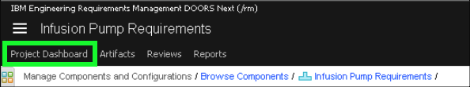

2. Click the **current context** button.

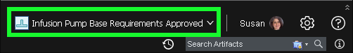

3. Click the **dropdown** button to see the recently used and favorite configurations.

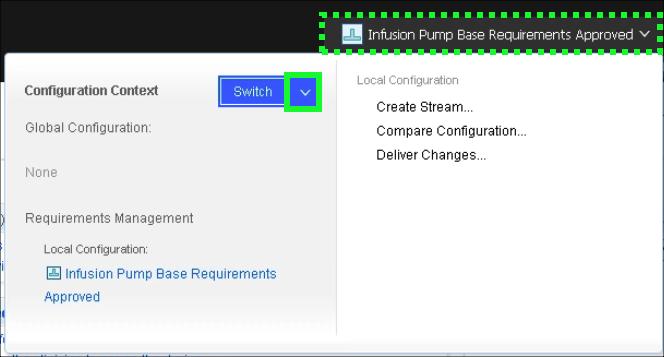

4. Click **Infusion Pump Base** under **Favorite Global Configurations**.

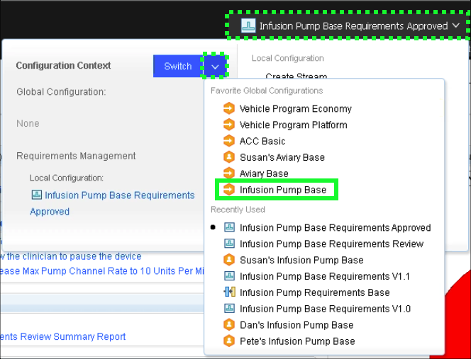

5. Notice the **FMEA** and **Operational Hazard Analysis** tabs on the **Infusion Pump Requirements Project Dashboard**.

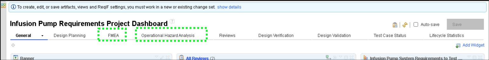

There are many similarities between **operational hazard analysis** and **Failure Modes and Effects (FMEA)**. Both examine functions, failure ‘modes’ (equipment failures or incorrect operations), effects, and causes. The primary difference is that operational hazard analysis focuses on what could go wrong if the device is not used correctly. FMEA focuses on identification of potential hazards in the design. Additionally, a hazard analysis focuses solely on safety hazards, whereas the scope of an FMEA covers safety as well as performance, quality, and reliability.

6. Click the **FMEA** tab.

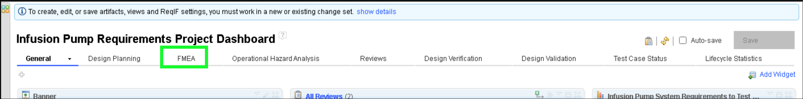

7. Explore the **FMEA** page.

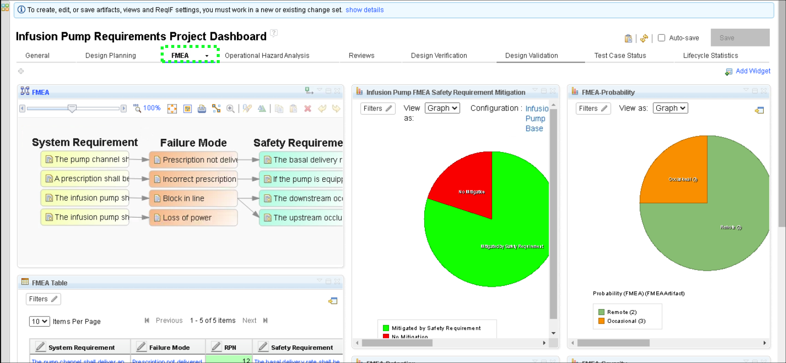

Note that this tab is surfacing analysis reports such as traceability from **System Requirement** to **Failure Mode** to the **Safety Requirement** that mitigates it – and metrics such as how many Failure modes have mitigations versus those that do not.

8. Right-click the first **Failure Mode** box and click **Open Artifact**.

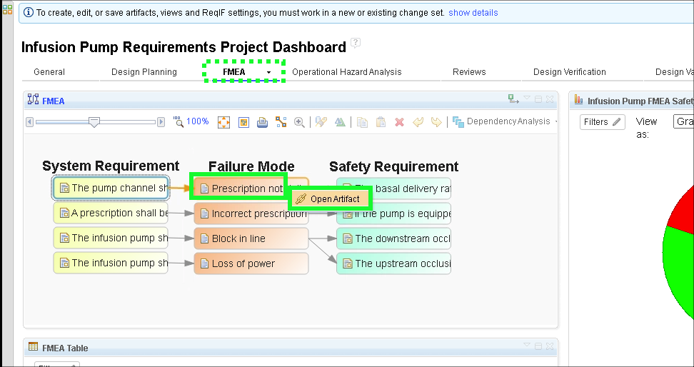

9. Click **FMEA View** in the **Views** panel.

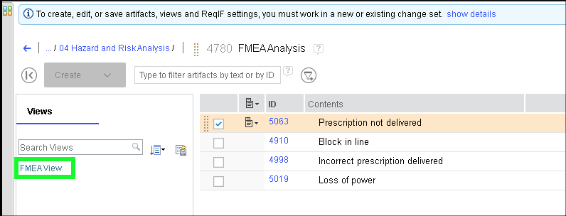

10. Explore the various columns in the analysis.

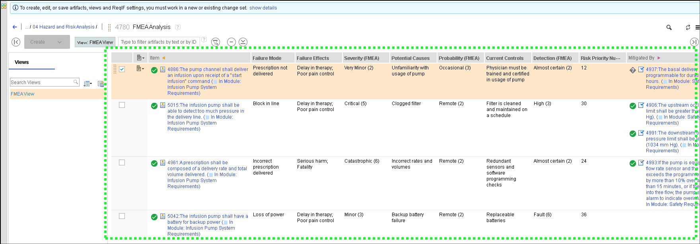

11. Click the **current context button**.

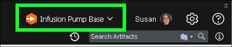

12. Click **Create Change Set...**.

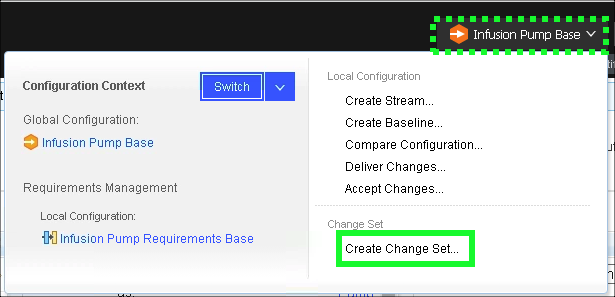

13. Enter **RPN** in the **Name** field and click **Create**.

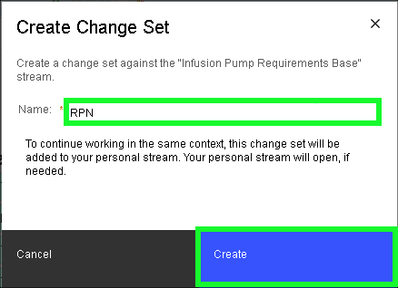

14. Double-click in the **Risk Priority Number** field of the first row of the table.

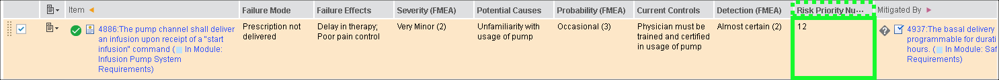

15. Delete the value **12** and click **OK** so the cell is empty.

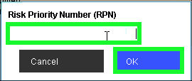

16. Expand the **Mini Dashboard** and **pin** it open.

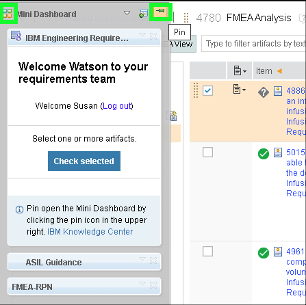

17. Expand the **FMEA-RPN** widget in the **Mini Dashboard**.

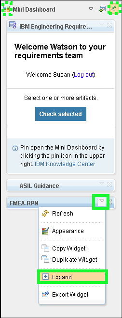

18. Scroll down in the **FMEA-RPN** widget and click the **Calculate RPN** button.

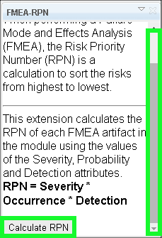

19. Notice that the correct value is re-inserted into the RPN cell.

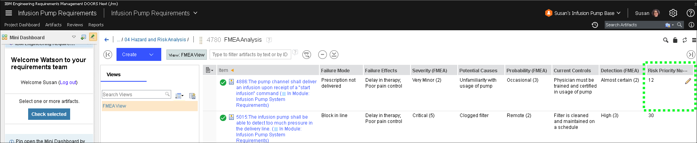

20. Click the **current context button**.

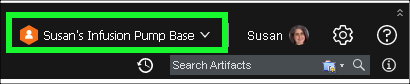

21. Click **Discard Change Set..**.

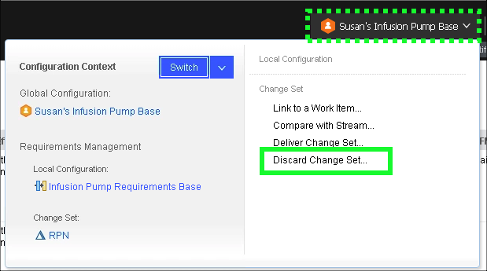

22. Click **Discard the Change Set** in the pop-up dialog.

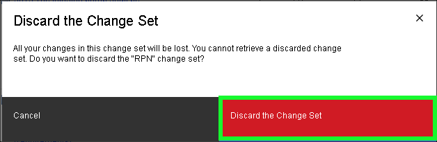

23. Click the **Unpin** icon in the **Mini Dashboard** and click away from the **Mini Dashboard**.

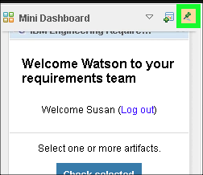

24. Switch back to **Infusion Pump Base** under **Favorite Global Configurations** in the **current context button**.

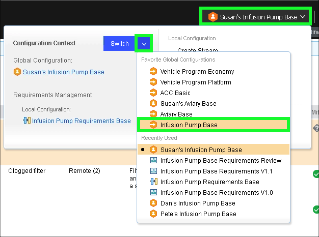

25. Click the **Project Dashboard** in the top header bar.

26. Click the **Operational Hazard Analysis** tab.

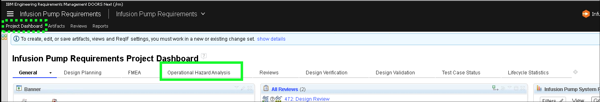

27. Explore the **Operational Hazard Analysis** tab.

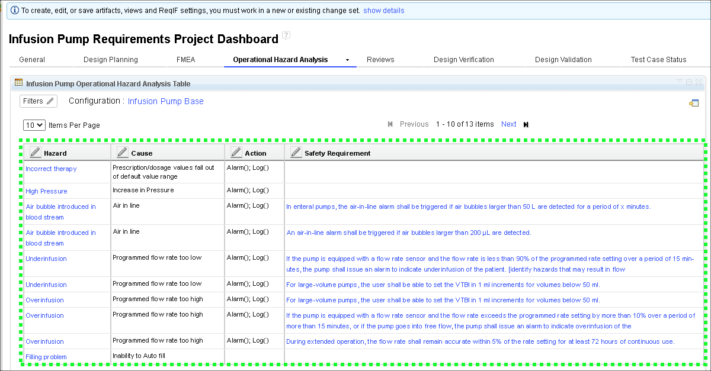

Note, the tab has a table of hazards containing their possible causes, actions, and the safety requirements that mitigate the hazards. The analysis is done in a similar way as FMEA, so no need to dive into this one.

28. Click the **Risk Management File** link in the **Generated Documentation** widget.

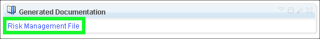

??? info "Birds-eye view"
    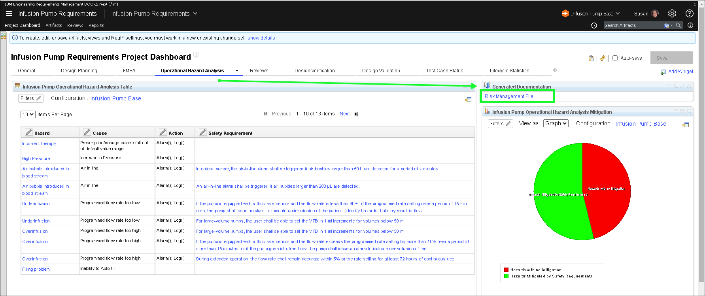

29. Explore the **Risk Management File** generated document.

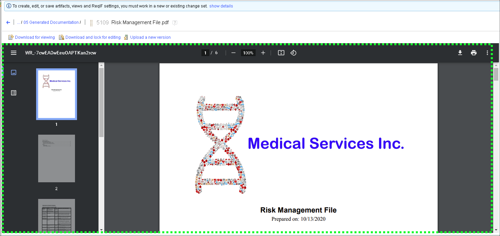

This document was generated from the platform by Document Builder and delivered in Portable Document Format (PDF) for convenience. The Risk Management File combines both types of fault and hazard analysis into a single document and includes both tables and metric graphs.

30. Close the **Risk Management File** and **Requirements Management (RM)** browser tabs.

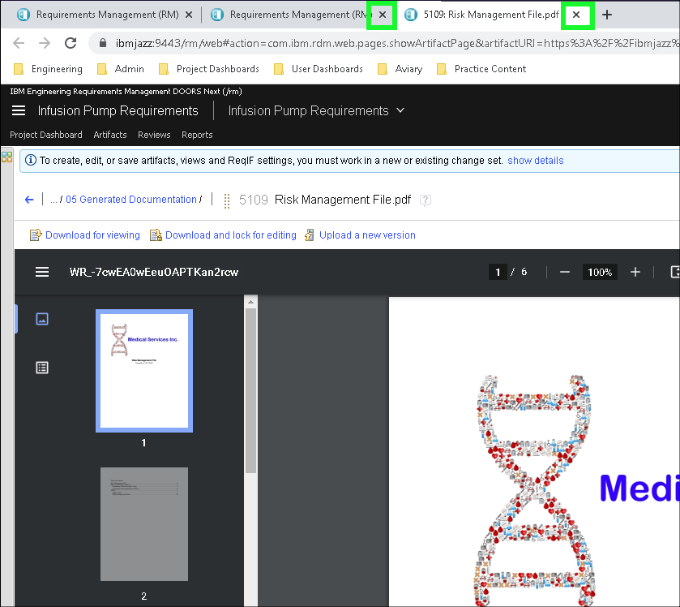
