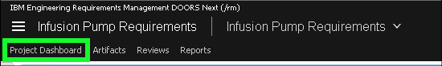

!!! quote "Sample narration"
    Now let’s look at risk management.
    First we’ll return to our project dashboard and once again we’ll switch back to the main team working area.

    Here on our dashboard we have two tabs of interest – FMEA or Failure Modes and Effects Analysis and Operational Hazard Analysis. There are many similarities between the two – they both examine failure modes, effects and causes – the primary difference is that operational hazard analysis focuses on what could go wrong if the product is used incorrectly whilst FMEA focuses on the identification of possible failures in the design of the product components.

    Lets start with FMEA. Our dashboard is surfacing the results of the FMEA analysis in a consumable way – for example at the top here we have a traceability view from the system requirement to a potential failure related to that requirement, to the safety requirement that was created to mitigate against the risk of that happening.

    On the right we have more of a metrics view – how many failure modes are mitigated by safety requirements and how many are not.

    These are not just pictures of course this is all live data. Let’s use the traceability view to navigate into the FMEA document and see the analysis.

    Here we can see the columns of information that allow us to perform the FMEA – the identified failure mode, the effects of that failure, its potential causes and any current controls we have in place. Those assessments allow us to assign numeric values for Severity, Probability and Detection – and those can then be used to calculate the Risk Priority Number or RPN which is a simple measure of comparison.

    Here too the platform can help by automating steps or performing calculations on the data.
    Lets see an example of this in action – we’’ll start by making a change set so we can make some changes to this data.

    Then lets edit this Risk Priority Number and actually delete that value.

    Now in our mini-dashboard we can expand this RPN Calculator which will perform that calculation for us and populate the field again. Of course that’s a very simple example and a very simple calculation but it shows how the basic capabilities of the platform may be extended with automation widgets like these.

    OK lets go ahead and discard that changeset – and as before we’ll also switch back to the team area.

    Back on our Project Dashboard lets now select Operational Hazard Analysis. That analysis is performed in much the same way as FMEA with the major difference being that these hazards are the result of user error rather than device failure.

    The ELM Platform allows for automatic generation of federated documentation. Here we have a link to an automatically generated document that combines both of those analyses into a Risk Management File.

1. Click the **Project Dashboard** tab in the top header bar.

2. Click the **current context** button.

3. Click the **dropdown** button to see the recently used and favorite configurations.

4. Click **Infusion Pump Base** under **Favorite Global Configurations**.

5. Notice the **FMEA** and **Operational Hazard Analysis** tabs on the **Infusion Pump Requirements Project Dashboard**.

There are many similarities between **operational hazard analysis** and **Failure Modes and Effects (FMEA)**. Both examine functions, failure ‘modes’ (equipment failures or incorrect operations), effects and causes. The primary difference is that operational hazard analysis focuses on what could go wrong if the device is not used correctly. FMEA focuses on identification of potential hazards in the design. Additionally, a hazard analysis focuses solely on safety hazards whereas the scope of an FMEA covers safety as well as performance, quality and reliability.

6. Click the **FEMA** tab.

7. Explore the **FEMA** page.

Note that this tab is surfacing analysis reports such as traceability from **System Requirement** to **Failure Mode** to the **Safety Requirement** that mitigates it – and metrics such as how many Failure modes have mitigations versus those that do not.

8. Right-click the first **Failure Mode** box and click **Open Artifact**.

9. Click **FMEA View** in the **Views** panel.

10. Explore the various columns in the analysis.

11. Click the **current context button**.

12. Click **Create Change Set...**.

13. Enter **RPN** in the **Name** field and click **OK**.

14. Double-click in the **Risk Priority Number** field of the first row of the table.

15. Delete the value **12** and click **OK** so the cell is empty.

16. Expand the **Mini Dashboard** and **pin** it open.

17. Expand the **FMEA-RPN** widget in the **Mini Dashboard**.

18. Scroll down in the **FMEA-RPN**  widget and click the **Calculate RPN** button.

19. Notice that the correct value is re-inserted into the RPN cell.

20. Click the **current context button**.

21. Click **Discard Change Set..**.

22. Click **Discard the Change Set** in the pop-up dialog.

23. Click the **Unpin** icon in the **Mini Dashboard** and click away from the **Mini Dashboard**.

24. Switch back to **Infusion Pump Base** under **Favorite Global Configurations** in the **current context button**.

25. Click the **Project Dashboard** in the top header bar.

26. Click the **Operational Hazar Analysis** tab.

27. Explore the **Operational Hazard Analysis** tab.

Note, the tab has a table of hazards containing their possible causes, actions, and the safety requirements that mitigate the hazards. The analysis is done in a similar way as FMEA so no need to dive into this one.

28. Click the **Risk Management File** link in the **Generated Documentation** widget.

??? info "Birds eye view"
    

29. Explore the **Risk Management File** generated document.

This document was generated from the platform by Document Builder and delivered in Portable Document Format (PDF) for convenience. The Risk Management File combines both types of fault and hazard analysis into a single document and includes both tables and metric graphs.

30. Close the **Risk Management File** and **Requirements Management (RM)** browser tabs.

