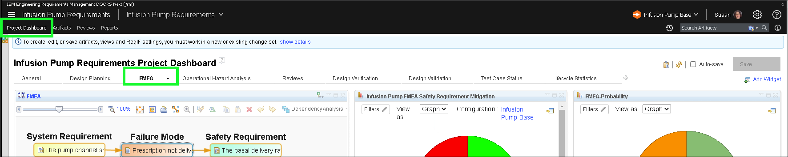
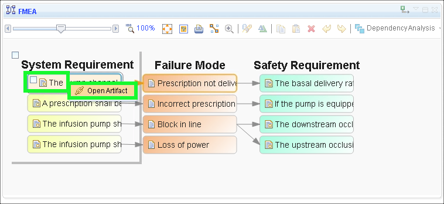
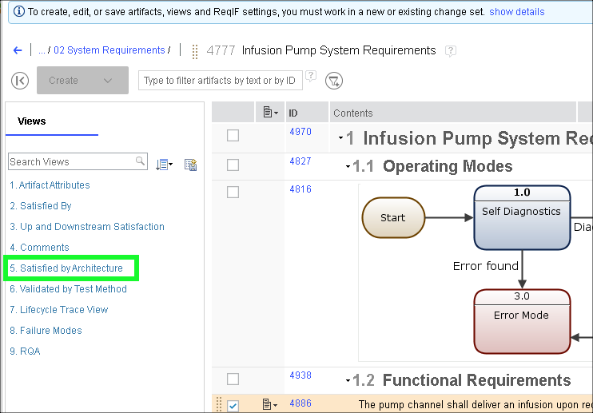
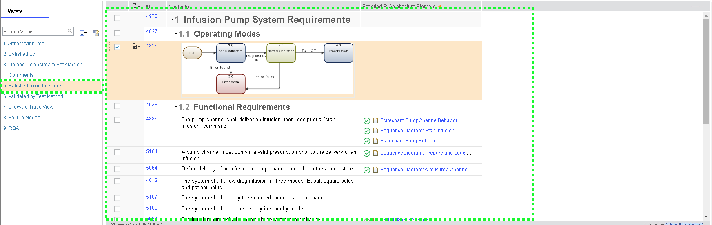
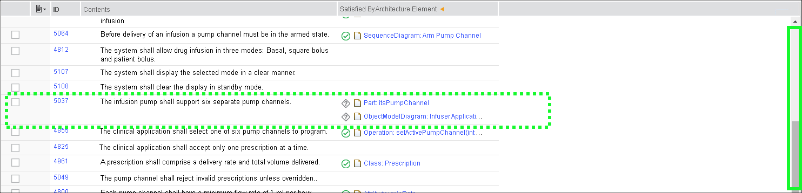
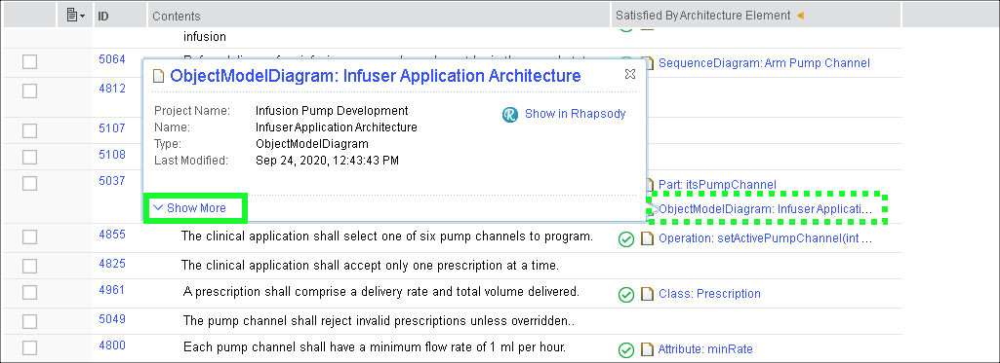
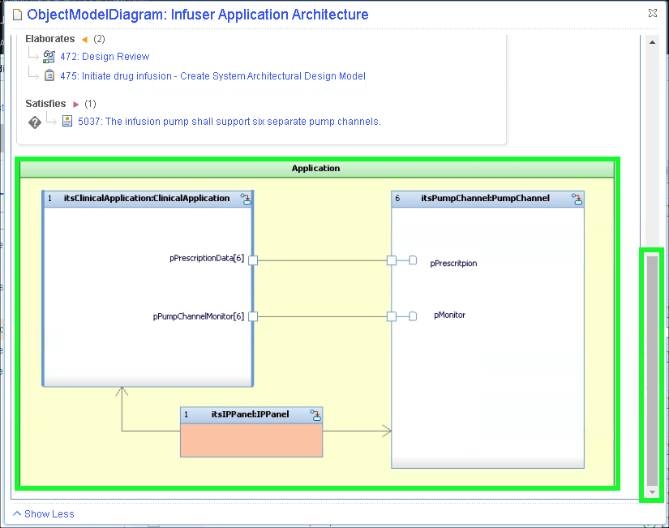
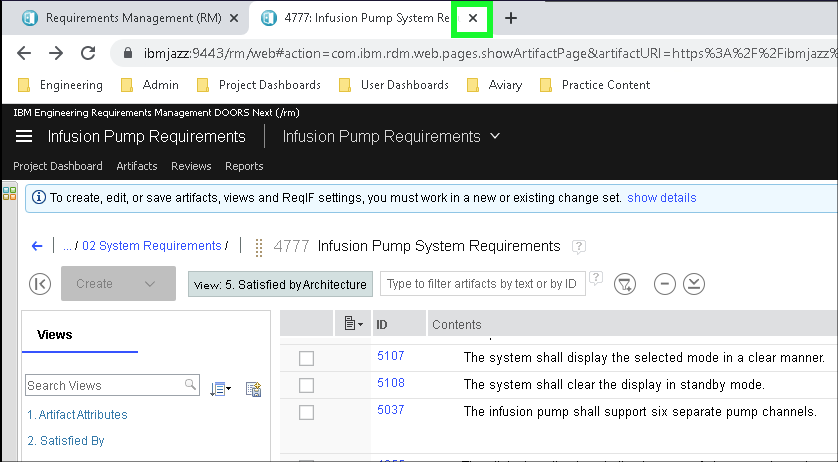

The video below illustrates how this Act of the ELM demonstration can be performed for a client.

??? quote "Sample narration"
    Next, look at Design Output – starting with design verification. Let's use the traceability view here to return to our System Requirements, and then Lets apply another view to that document – one that shows us elements from our design that satisfy these system requirements. Here we also have gap analysis and link validity, this time between the requirements and the design. Rich Hover can be used to great effect here, allowing requirements engineers to see linked design artifacts such as this architecture diagram without ever having to open or navigate a model.

    If we do want to explore further, then we can click on any one of these links and navigate into that design. These are not just pictures – this is the actual model that contains not only the architecture but also the functional analysis, the behavior, and so on. If we click this state machine symbol in the corner of the Pump Channel, we can see its state based behavior. Models like this may be executed to verify and validate the system requirements they are traced to, or can be used to generate production quality source code if the model is at the software level.

    If we return to our Project Dashboard and select the Design Verification tab, we can see more analysis. On the right we have a traceability view of the designs coverage of the requirements. Again this is not a picture; this is live data that we can use for analysis and navigation. On the left, that same traceability is presented as a table at the bottom, and as pie graph of coverage metrics at the top.

1. If not already there, return to the **FMEA** tab of the **Project Dashboard**.

2. Right-click on the first **System Requirement** and click **Open Artifact**.

3. Click **5. Satisfied by Architecture** in the **Views** panel.

4. Explore the **Satisfied by Architecture** view.

5. Scroll down to where **5037 The infusion pump shall support six separate pump channels.** is visible in the table.

6. Hover over the linked **ObjectModelDiagram** and click **Show More**.

7. Note the **Show in Rhapsody** link.

Rhapsody Model Manager is a web-based solution that integrates with Rhapsody and OSLC Jazz-based tools to provide lifecycle traceability for models, wider availability of models to stakeholders by making them available on the web, and source control / configuration management. This Architectural Management (AM) solution enables models to be first-class participants in the development lifecycle.

**Rhapsody Model Manager has not been in this demonstration environment. Clicking on the link will display an error message. **

8. Close the **Infusion Pump System Requirement** browser tab.

