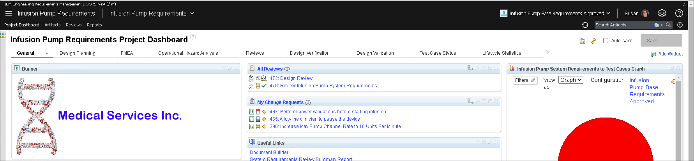
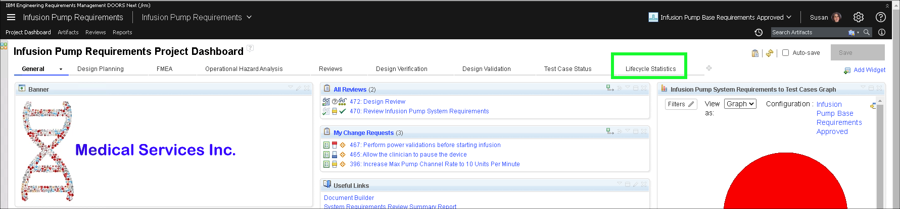
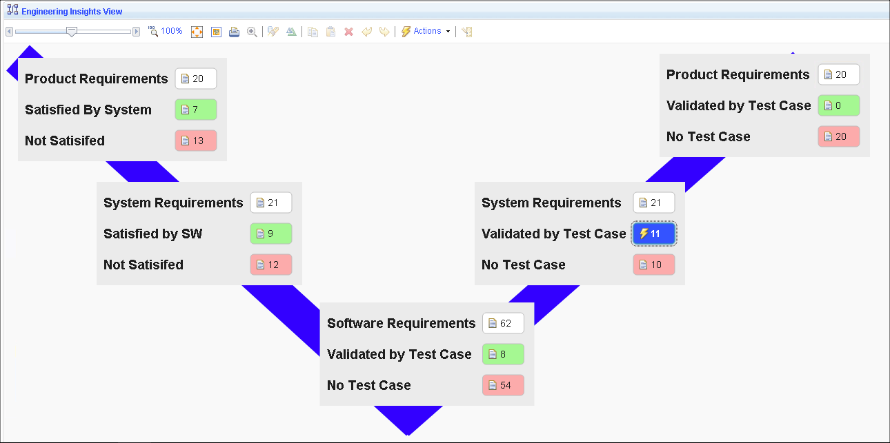
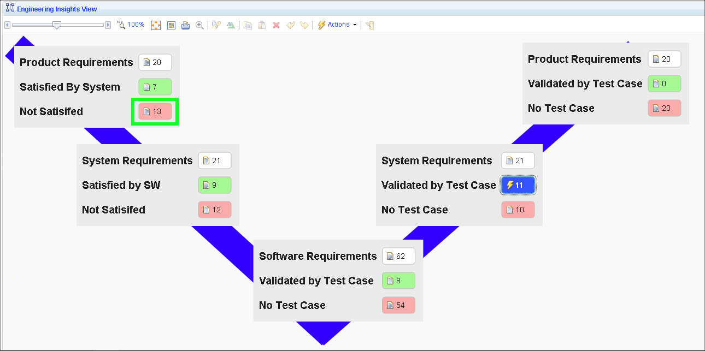
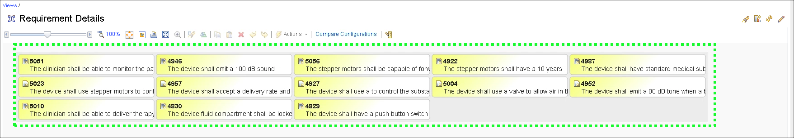

1. If not already there, return to the **Infusion Pump Requirements Project Dashboard**.

2. Click the **Lifecycle Statistics** tab.

3. Notice the view shows completion metrics between the different layers of requirements, and between requirements and tests.

4. Click the **red box** for **Product Requirements**.

5. Notice the view shows the requirements that have not been satisfied.

From here, one can navigate into each requirement using Engineering Requirements Management (ERM).

That concludes the demonstration of ELM.
