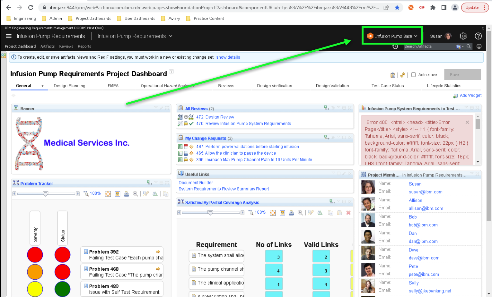
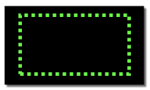
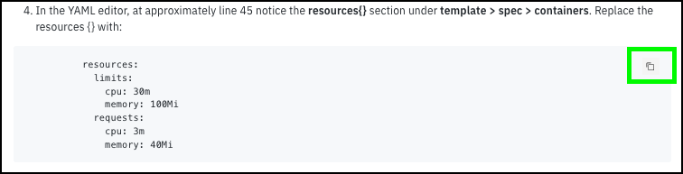
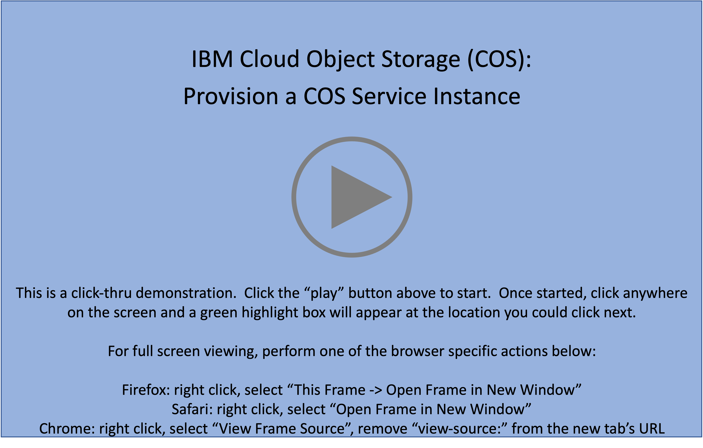

Welcome to the {{learningplan.name}} demonstration guide! The goal of this demonstration guide is to provide sellers and technical sellers from IBM and Business Partners with the knowledge and tools to perform hands-on demonstrations of {{offering.name}}. Throughout this demonstration guide {{offering.name}} will be referred to as ELM.

Please read this page, the Introduction, Prerequisites, and Demo Preparation pages in their entirety! Failing to do so will make completing this demonstration guide difficult.

While everyone is encouraged to complete all sections of the demonstration guide, actual completion requirements vary by role:

- IBM Sales:

    * Complete Acts 1, 2, and 3 of this demonstration guide
    * Record and submit a Stand and Deliver demonstration to be evaluated by management (details in the Your Learning plan)

- IBM Technical Sales:

    * Complete **all** Acts of this demonstration guide
    * Record and submit a Stand and Deliver demonstration to be evaluated by management (details in the Your Learning plan)

- Business Partner Sales:

    * Complete Acts 1, 2, and 3 of this demonstration guide
    * Successfully pass a 5 question quiz found in the learn.ibm.com plan

- Business Partner Technical Sales:

    * Complete **all** Acts of this demonstration guide
    * Successfully pass a 5 question quiz found in the learn.ibm.com plan

**IBM Sales and Tech Sales** must develop and record a Stand & Deliver presentation. This video is intended to simulate delivery of a “live” demo in front of a client — on camera. IBMers will have flexibility in defining a hypothetical client, the pain points the client has, and the goals they aspire to achieve. The recording will then cover the seller’s hands-on demonstration and pitch to the client of the value of the IBM solution using the environment and techniques of this lab. Specific criteria that must be demonstrated as part of the Stand & Deliver recordings is provided within the documentation that accompanies the Level 3 course in Your Learning.

**Business Partners** must pass an accreditation quiz after completing the hands-on portion of the course. The quiz consists of multiple choice questions, with four possible responses (and only one correct answer) for each question. **Hint: keep the demonstration guide and the associated IBM Technology Zone (TechZone) environment active while completing the quiz.**

Before jumping to part 1, please read the guidance below. Reading and understanding the information will save time while completing the steps in this guide.

## Helpful tips for using this demonstration guide and environment

The {{guide.name}} is organized into Acts. Most Acts contain numbered steps, which are actions to be performed.

Throughout the guide, images are used to help guide students through the demonstration.

!!! warning
    The {{offering.name}} user interface and data changes on a regular basis. Images captured in this guide may differ from the live demonstration environment in TechZone.

The following styles of highlighting are utilized in images:

- Action highlight box: Illustrates where to click, enter, or select an item:

- Path/explore highlight box: Illustrates one of two things:

    - the path to follow to get to a specific location in the user interface
    - areas to explore

To assist in navigating the browser-based user interface (UI), a **birds-eye view** of the UI is often provided. Expand these views by clicking on the **>** icon of the expandable section of documentation.

??? tip "Birds-eye view"
    

- Copy to clipboard box: The text is copied to the clipboard. Click the copy icon (highlighted below) and then paste using the operating system's paste function, for example, entering ++ctrl++**+v**, ++cmd++**+v**, or right-click and select paste.

Additionally, throughout the demonstration guide there are sample narration scripts. The short narratives can be utilized when performing client-facing demonstrations.

!!! quote "Sample narration"
    In this demonstration we’ll see how an infusion pump was engineered using the IBM ELM solution, in alignment with industry standards like ISO 13485 and IEC 62304 for development and ISO 14971 for risk management. We’ll break the demo up into five acts...

<!-- Additionally, there are several "click-thru" demonstrations. Links to click-thru demonstrations will open in a new browser window or tab with a screen similar to the image below.

Click the play button  in the middle of the screen to start the demo. Then, simply follow the steps in the demonstration guide. If unsure where to click, click anywhere on the screen and a highlight box will appear showing where to click next.

**In this demonstration environment, full access to the IBM Cloud account is NOT provided.** User identifications (IDs) will be restricted to specific capabilities. Permission to create or modify COS service instances, COS buckets, Key Protect instances, etc. is not provided.

!!! warning
    Attempting to perform an action without the appropriate permissions will result in an error message like the one below. This is not an issue with the IBM Cloud or COS, rather a restriction of the demo environment and the permissions assigned to users.

     -->

## Acronyms

The following acronyms are used throughout this demonstration guide:

    - Application programming interfaces (APIs)
    - Architectural Management (AM)
    - Change and Configuration Management (CCM)
    - Control (ctrl) - The control key on keyboard
    - Engineering Lifecycle Management (ELM)
    - Engineering Test Management (ETM)
    - Failure Modes and Effects Analysis (FMEA)
    - IBM Technology Zone (TZ) - Also referred to as TechZone
    - Identification (ID)
    - International Electrotechnical Commission (IEC)
    - International Organization for Standardization (ISO)
    - Open Services for Lifecycle Collaboration (OSLC)
    - Portable Document Format (PDF)
    - Requirements Management (RM)
    - Requirements Quality Assistant (RQA)
    - Risk Priority Number (RPN)
    - Software (SW)
    - Virtual Machine (VM)

It is now time to proceed to the next section, an overview of {{offering.name}}.
